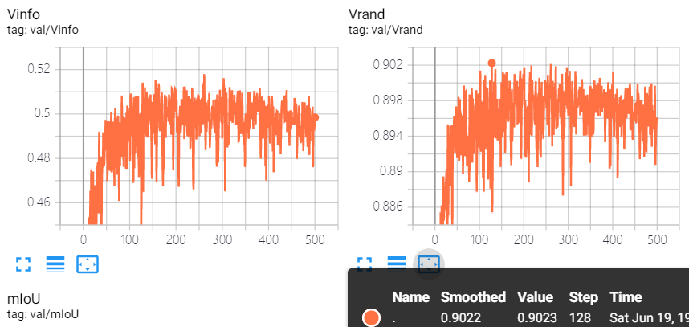

# CS420-Machine-Learning

## Attention-based Forward Passing for Enhancing UNet Segmentation on Electron Microscopy Images

#### 518021910645  Xinyu Xu

This is the final project for course CS420 Machine Learning


## Prerequisites 

    python==3.6
    
    PyTorch==1.8
    tensorboardX
    albumentations
    opencv-python
    numpy 
    tqdm

## Code Structure

#### Data
Put the dataset into ```./dataset``` folder, including  ```./dataset/train_img```, ```./dataset/train_label```, ```./dataset/test_img```, ```./dataset/test_label```.

Since the label of 0.png in the given test set is wrongly rotated, our code will automatically handle this error.

#### Network

I provide implementation of 4 networks in ```./models``` folder, including UNet[1], UNet++[2] and their advanced version by attention.

You can use ```--network``` parameter to specify network architecture. ```UNet, UNetPlus, AttentionUNet, AttentionUNetPlus``` are available.


## Evaluate model

The best model (Attention enhanced UNet) and the baseline are provided in [Jbox](https://jbox.sjtu.edu.cn/l/81HdLs).

You can download the pre-trained model and run following command for evaluation.

```
(Best)     python main_test.py --network AttentionUNet --pretrained [path-to-downloaded-model]
(Baseline) python main_test.py --network UNet --pretrained [path-to-downloaded-model]
```


## Reproduce the training

If you want to train from scratch, please run following command.

```
python main_train.py --network UNet --save_dir [SAVE_DIR]
python main_train.py --network UNetPlus --save_dir [SAVE_DIR]
python main_train.py --network AttentionUNet --save_dir [SAVE_DIR] --bz 1
python main_train.py --network AttentionUNetPlus --save_dir [SAVE_DIR] --bz 1
```

Then the weight of trained model will be stored in ```./checkpoints/[SAVE_DIR]``` and tensorboard logs will be stored in ```./logs/[SAVE_DIR]```.

We use CrossEntropy loss in default. You can use Dice loss by ```--loss Dice```.

## Reference

[1] Olaf Ronneberger, Philipp Fischer, and Thomas Brox. U-net: Convolutional networks for biomedicalimage segmentation. InInternational Conference on Medical image computing and computer-assistedintervention, pages 234–241. Springer, 2015

[2] Zongwei Zhou, Md Mahfuzur Rahman Siddiquee, Nima Tajbakhsh, and Jianming Liang. Unet++: Anested u-net architecture for medical image segmentation. InDeep learning in medical image analysisand multimodal learning for clinical decision support, pages 3–11. Springer, 2018